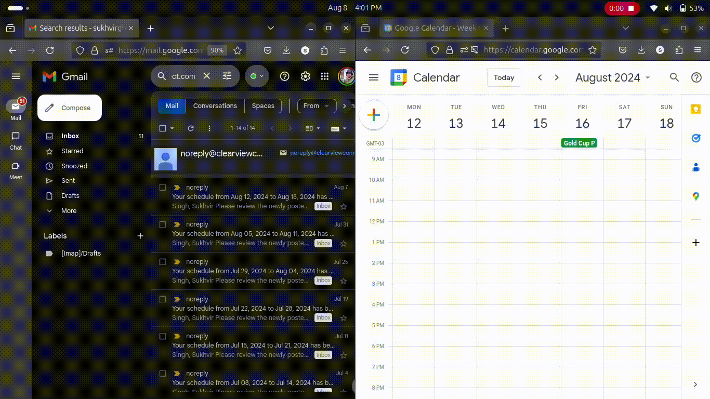
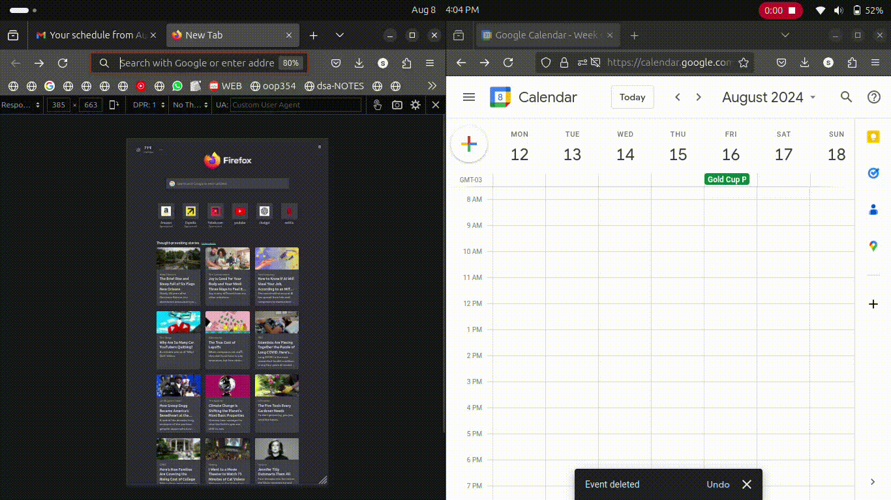

# # Tim Schedule App

## Overview
The Tim Schedule App is a web application designed to streamline the process of managing schedules for employees at our Tim Hortons locations. The app integrates with Google Calendar and Gmail to automatically fetch and manage calendar events from schedule emails.

## Motivation
Before creating this app, I had to manually check my emails and add events to my Google Calendar because I liked its design and functionality. This process was time-consuming and tedious. I thought, "Why not create a website that allows me to do all of this with one click?" Not only would this save me time, but it would also benefit my coworkers, who could use this tool to streamline their own workflows.

## Features
- Fetch recent emails from a specific sender
- Add events to Google Calendar
- Prevent duplicate events
- Persistent authorization to avoid re-login

## Before (Manually)

## After (Automated)

## Usage

**Navigate to the application in your browser:**
    [TimSchedule.com](http://timschedule.com/)
